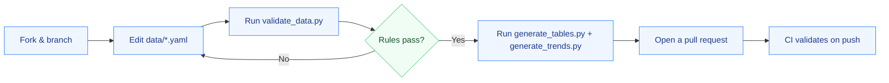

# 🤝 Contributing to Aerial-Ground Person Re-Identification

Thanks for helping keep this AGPReID resource accurate and useful!

[](/CONTRIBUTING.md)
[](/LICENSE)

## 🧭 Contribution flow



## 📦 What you can contribute

- New aerial-ground person ReID papers
- Dataset metadata or corrections
- Official code, project pages and pretrained models
- Reproduced benchmark results
- New evaluation protocols
- Broken-link fixes
- Taxonomy improvements

## 📄 Paper contribution

Add or update a record in `data/papers.yaml`.

Required fields — copy and adapt an existing record, e.g. GeoReID:

```yaml
- id: georeid-2026
  method: GeoReID
  year: 2026
  venue: arXiv
  title: "Rectifying Geometry-Induced Similarity Distortions for Real-World Aerial-Ground Person Re-Identification"
  task: image-ag-reid
  categories: [geometry-conditioning, attention, similarity-rectification, prompt-learning]
  datasets: [CARGO, AG-ReID.v2, LAGPeR, DetReIDX]
  paper: https://arxiv.org/abs/2601.21405
  code: https://github.com/kailashhambarde/GeoReID
  status: preprint
  verified_on: 2026-08-18
```

`code` is optional — use `code: null` when no official code exists. `datasets` and `categories` may be empty lists. `status` is `peer-reviewed` or `preprint`; `verified_on` is the date you checked the record.

> [!WARNING]
> Do **not** infer code availability, venue acceptance, dataset statistics or benchmark numbers. Link an official paper/project/repository whenever possible.

## 📊 Benchmark contribution

Every result must specify the exact protocol. At minimum include:

- dataset
- split/protocol name
- direction, e.g. A2G or G2A
- method
- backbone
- Rank-1 and/or mAP
- re-ranking status
- source URL
- result type: `official`, `paper-reported`, or `reproduced`

> [!IMPORTANT]
> Do **not** compare results across incompatible splits in one ranking table. See the [Evaluation Guide](docs/evaluation.md) and [Leaderboard Rules](leaderboards/README.md).

## ✅ Pull request checklist

- [ ] Metadata is sourced from an original paper, official project page, or official repository.
- [ ] URLs are valid.
- [ ] YAML passes `python scripts/validate_data.py`.
- [ ] `python scripts/generate_tables.py` and `python scripts/generate_trends.py` were run (or CI regenerates the tables/chart for you).
- [ ] The entry is in scope for aerial-ground **person** ReID.
- [ ] Benchmark protocol is explicitly identified.
- [ ] No duplicate paper or dataset record was introduced.

> [!TIP]
> Prefer the structured issue templates for proposals: [add a paper](https://github.com/kailashhambarde/Aerial-Ground-Person-ReID/issues/new?template=add-paper.yml) or [add a benchmark result](https://github.com/kailashhambarde/Aerial-Ground-Person-ReID/issues/new?template=add-result.yml).
