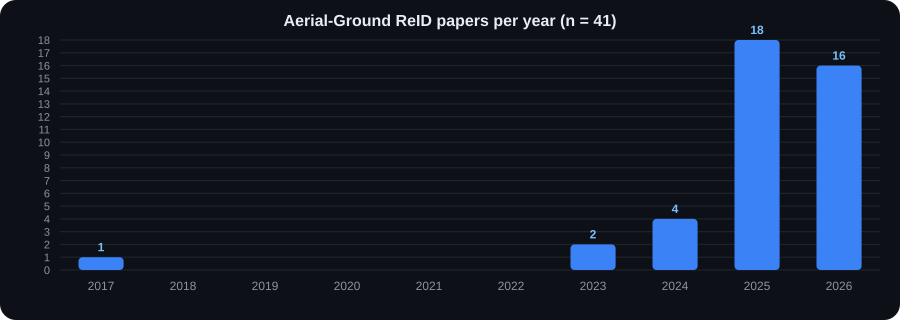

# 🚁 Aerial-Ground Person Re-Identification

<picture>
  <source media="(prefers-color-scheme: dark)" srcset="assets/banner.svg">
  <source media="(prefers-color-scheme: light)" srcset="assets/banner-light.svg">
  
</picture>

> **Papers · Datasets · Taxonomy · Evaluation Protocols · Leaderboards · Code — for Aerial-Ground Person Re-Identification (AGPReID).**

<div align="center">

[](LICENSE)
[](https://github.com/kailashhambarde/Aerial-Ground-Person-ReID/releases)
[](https://github.com/kailashhambarde/Aerial-Ground-Person-ReID/actions/workflows/validate.yml)
[](https://github.com/kailashhambarde/Aerial-Ground-Person-ReID/commits/main)
[](https://github.com/kailashhambarde/Aerial-Ground-Person-ReID/graphs/contributors)

[](https://github.com/kailashhambarde/Aerial-Ground-Person-ReID)
[](https://github.com/kailashhambarde/Aerial-Ground-Person-ReID/fork)
[](https://github.com/kailashhambarde/Aerial-Ground-Person-ReID/issues)
[](https://github.com/kailashhambarde/Aerial-Ground-Person-ReID/pulls)
[](/CONTRIBUTING.md)

</div>

> [!NOTE]
> **Last verified: 18 August 2026.** This repository is more than a paper list — it is a **protocol-aware, machine-readable resource** for AGPReID, designed to make methods, datasets and evaluation settings easier to find, compare and reproduce.

## 📖 Table of contents

- [Why this repository exists](#-why-this-repository-exists)
- [Field map](#-field-map)
- [Repository at a glance](#-repository-at-a-glance)
- [Quick navigation](#-quick-navigation)
- [Papers & methods](#-papers--methods)
- [Datasets](#-datasets)
- [Publication trends](#-publication-trends)
- [Star history](#-star-history)
- [Comparison policy](#-comparison-policy)
- [Machine-readable first](#-machine-readable-first)
- [Automation](#-automation)
- [Contributing](#-contributing)
- [License & citation](#-license--citation)

## 🎯 Why this repository exists

Aerial-ground person ReID has expanded rapidly — from early aerial-ground benchmarks to image-based, video-based, multispectral, geometry-aware, vision-language and extreme-distance settings. Results are scattered across papers, code repositories and **incompatible evaluation protocols**. This repository organizes AGPReID research around the questions that matter:

- **What problem** does a method solve — not just where it was published?
- **Which protocol** does a result belong to — dataset, split, direction, image/video, re-ranking?
- **What can be compared** — and what must *never* be merged into a single SOTA table?

## 🗺️ Field map

```mermaid
flowchart TB
    AG["Aerial-Ground Person ReID"]
    AG --> IMG["Image-based ReID"]
    AG --> VID["Video-based ReID"]
    AG --> MM["Multimodal ReID"]
    AG --> EV["Evaluation"]

    IMG --> IMG1["View-invariant representation"]
    IMG --> IMG2["View-aware / view-specific"]
    IMG --> IMG3["Geometry & spatial alignment"]
    IMG --> IMG4["Semantic / prompt / VL alignment"]
    IMG --> IMG5["Novel-view / generative"]

    VID --> VID1["Temporal aggregation"]
    VID --> VID2["Tracklet quality / uncertainty"]
    VID --> VID3["Extreme far-distance recognition"]
    VID --> VID4["Multi-camera / cross-platform"]

    MM --> MM1["RGB ↔ Infrared"]
    MM --> MM2["Multispectral aerial-ground"]
    MM --> MM3["Text / vision-language retrieval"]

    EV --> EV1["Aerial → Ground / Ground → Aerial"]
    EV --> EV2["Cross-session / clothing change"]
    EV --> EV3["Cross-dataset generalization"]
    EV --> EV4["Unseen geometry / altitude / distance"]

    classDef leaf fill:#eff6ff,stroke:#3b82f6,color:#1e3a8a;
    classDef root fill:#1e293b,stroke:#0f172a,color:#ffffff;
    class IMG1,IMG2,IMG3,IMG4,IMG5,VID1,VID2,VID3,VID4,MM1,MM2,MM3,EV1,EV2,EV3,EV4 leaf;
    class AG root;
```



## 📊 Repository at a glance

| Stat | Value |
|---|---:|
| Papers tracked | **41** (38 peer-reviewed, 3 preprints) |
| Methods with public code | **20** |
| Datasets catalogued | **13** |
| Total identities covered | **25,337** |
| Evaluation directions | A2G · G2A · A2A · G2G · ALL |
| Machine-readable sources | `papers.yaml` · `datasets.yaml` · `benchmarks.csv` |
| CI status | [](https://github.com/kailashhambarde/Aerial-Ground-Person-ReID/actions/workflows/validate.yml) |

## 🧭 Quick navigation

| Resource | What it gives you |
|---|---|
| 🗂️ [Single-page index](index.html) | Everything on one page — grouped papers, datasets, live filter |
| 📄 [Papers](docs/papers.md) | Methods organized by year, task and research idea |
| 🗃️ [Datasets](docs/datasets.md) | Dataset scale, cameras, modalities and capture geometry |
| 🧬 [Method Taxonomy](docs/taxonomy.md) | Research families and how they differ |
| 🧪 [Evaluation Guide](docs/evaluation.md) | Protocols, metrics and comparison rules |
| 🏆 [Leaderboards](leaderboards/README.md) | Protocol-specific results only |
| 🧠 [Foundation Models](docs/foundation_models.md) | Training-free and pretrained-backbone evaluation plan |
| 🔭 [Open Problems](docs/open_problems.md) | Research gaps worth attacking |
| ⚙️ [Machine-readable data](data/) | YAML/CSV metadata for scripts and external tools |

## 🧩 Papers & methods

Grouped by problem setting with direct paper/code/dataset links — the same layout as the [Awesome Aerial-Ground Object Re-Identification](https://github.com/YangQiWei3/Awesome-Aerial-Ground-Object-Re-Identification) list. **Generated** from [`data/papers.yaml`](data/papers.yaml): edit the YAML, never these tables.

<!-- PAPERS:START -->
### Image-based Person AG-ReID

| Conference / Journal | Method | Title | Resources |
| :------------------- | :----- | :----- | :--------- |
| **ECCV 2026** | **3D-LENS** | 3D-LENS: A 3D Lifting-based Elevated Novel-view Synthesis method for Single-View Aerial-Ground Re-Identification | [Paper](https://arxiv.org/abs/2604.26520) · [Code](https://github.com/TurtleSmoke/3D-LENS) |
| **CVPR 2026** | **CFAN** | Cross-modal Fuzzy Alignment Network for Text-Aerial Person Retrieval and A Large-scale Benchmark | [Paper](https://arxiv.org/abs/2603.20721) |
| **arXiv 2026** | **GeoReID** | Rectifying Geometry-Induced Similarity Distortions for Real-World Aerial-Ground Person Re-Identification | [Paper](https://arxiv.org/abs/2601.21405) · [Code](https://github.com/kailashhambarde/GeoReID) |
| **PRCV 2026** | **GLPSG** | Global-local prompts-driven semantic guidance for aerial-ground person re-identification | [Paper](https://link.springer.com/chapter/10.1007/978-981-95-5755-4_7) |
| **ECCV 2026** | **HiHR** | Hierarchical Hyperbolic Representation for Aerial-Ground Person Re-Identification | [Paper](https://arxiv.org/abs/2607.09186) · [Code](https://github.com/YangQiWei3/HiHR) |
| **IEEE TIP 2026** | **SD-ReID** | View-aware Stable Diffusion for Aerial-Ground Person Re-Identification | [Paper](https://arxiv.org/abs/2504.09549) · [Code](https://github.com/924973292/SD-ReID) |
| **AAAI 2026** | **SVPR-ReID** | Semantic-Driven Visual Progressive Refinement for Aerial-Ground Person ReID: A Challenging Large-Scale Benchmark | [Paper](https://ojs.aaai.org/index.php/AAAI/article/view/38339) |
| **AAAI 2026** | **TAG-CLIP** | Text-based Aerial-Ground Object Retrieval | [Paper](https://arxiv.org/pdf/2511.08369) · [Code](https://github.com/Flame-Chasers/TAG-PR) |
| **CVPR 2026** | **UAD** | WHU-MARS: A Multispectral Aerial-Ground Benchmark Towards Any-Scenario Person Re-Identification | [Paper](https://openaccess.thecvf.com/content/CVPR2026/html/Zhao_WHU-MARS_A_Multispectral_Aerial-Ground_Benchmark_Towards_Any-Scenario_Person_Re-Identification_CVPR_2026_paper.html) |
| **CVPR 2026** | **ViSA** | View-Aware Semantic Alignment for Aerial-Ground Person Re-Identification | [Paper](https://openaccess.thecvf.com/content/CVPR2026/html/Zhang_View-Aware_Semantic_Alignment_for_Aerial-Ground_Person_Re-Identification_CVPR_2026_paper.html) |
| **ACM TOMM 2025** | **CVAF** | A CLIP-Based View-Consistent Alignment Framework for Aerial-Ground Person Re-Identification | [Paper](https://dl.acm.org/doi/pdf/10.1145/3785482) |
| **ICME 2025** | **DTST** | Dynamic Token Selective Transformer for Aerial-Ground Person Re-Identification | [Paper](https://yuhaiw.github.io/DTS-AGPReID/ICMEYuhai.pdf) · [Code](https://github.com/YuhaiW/reidselecttoken) |
| **NeurIPS 2025** | **GSAlign** | Geometric and Semantic Alignment Network for Aerial-Ground Person Re-Identification | [Paper](https://proceedings.neurips.cc/paper_files/paper/2025/hash/86c17de05579cde52025f9984e6e2ebb-Abstract-Conference.html) · [Code](https://github.com/stone96123/GSAlign) |
| **arXiv 2025** | **LATex** | Leveraging Attribute-based Text Knowledge for Aerial-Ground Person Re-Identification | [Paper](https://arxiv.org/abs/2503.23722) |
| **ICIG 2025** | **PDPA** | Perspective Driven Prototype Alignment for Aerial-Ground Person Re-identification | [Paper](https://link.springer.com/chapter/10.1007/978-981-95-3393-0_42) |
| **CVPR 2025** | **SeCap** | Self-Calibrating and Adaptive Prompts for Cross-view Person Re-Identification in Aerial-Ground Networks | [Paper](https://openaccess.thecvf.com/content/CVPR2025/html/Wang_SeCap_Self-Calibrating_and_Adaptive_Prompts_for_Cross-view_Person_Re-Identification_in_CVPR_2025_paper.html) · [Code](https://github.com/wangshining681/SeCap-AGPReID) |
| **Drones 2025** | **UAGRPG** | Unsupervised Aerial-Ground Re-Identification from Pedestrian to Group for UAV-Based Surveillance | [Paper](https://www.mdpi.com/2504-446X/9/4/244) |
| **ICCV 2025** | **VIF-AGReID** | Bridging the Sky and Ground: Towards View-Invariant Feature Learning for Aerial-Ground Person Re-Identification | [Paper](https://openaccess.thecvf.com/content/ICCV2025/html/Khalid_Bridging_the_Sky_and_Ground_Towards_View-Invariant_Feature_Learning_for_ICCV_2025_paper.html) |
| **Acta Automatica Sinica 2025** | — | Implicit Decoder Alignment for Aerial-ground Person Re-identification | [Paper](https://www.aas.net.cn/cn/article/doi/10.16383/j.aas.c240705) |
| **IEEE T-ITS 2024** | **AG-ReID.v2 baseline** | AG-ReID.v2: Bridging Aerial and Ground Views for Person Re-identification | [Paper](https://arxiv.org/abs/2401.02634) · [Code](https://github.com/huynguyen792/AG-ReID.v2) |
| **CVPR 2024** | **VDT** | View-decoupled Transformer for Person Re-identification under Aerial-ground Camera Network | [Paper](https://openaccess.thecvf.com/content/CVPR2024/html/Zhang_View-decoupled_Transformer_for_Person_Re-identification_under_Aerial-ground_Camera_Network_CVPR_2024_paper.html) · [Code](https://github.com/LinlyAC/VDT-AGPReID) |
| **ICME 2023** | **Explainable AG-ReID** | Aerial-Ground Person Re-ID | [Paper](https://arxiv.org/abs/2303.08597) · [Code](https://github.com/huynguyen792/AG-ReID) |
| **ATR 2017** | — | Person Re-Identification Across Aerial and Ground-Based Cameras by Deep Feature Fusion | [Paper](https://publica.fraunhofer.de/bitstreams/ef904224-f31f-484d-b8d2-56695e46779c/download) |

### Image-based Vehicle AG-ReID

| Conference / Journal | Method | Title | Resources |
| :------------------- | :----- | :----- | :--------- |
| **Remote Sensing 2025** | **AGID** | Aerial-Ground Cross-View Vehicle Re-Identification: A Benchmark Dataset and Baseline | [Paper](https://www.mdpi.com/2072-4292/17/15/2653) |
| **SENSORS 2025** | **CVNet** | Lightweight Cross-View Vehicle ReID with Multi-Scale Localization | [Paper](https://www.mdpi.com/1424-8220/25/9/2809) |

### Video-based Person AG-ReID

| Conference / Journal | Method | Title | Resources |
| :------------------- | :----- | :----- | :--------- |
| **IEEE T-BIOM 2026** | **DetReIDX baselines** | DetReIDX: A Stress-Test Dataset for Real-World UAV-Based Person Recognition | [Paper](https://arxiv.org/abs/2505.04793) · [Code](https://www.it.ubi.pt/DetReIDX/) |
| **WACV Workshops 2026** | **DFGS + uncertainty fusion** | Enhancing Aerial-Ground Video Person Re-Identification via DFGS-Guided CLIP Sampling and Inference-Time Uncertainty-Aware Fusion | [Paper](https://openaccess.thecvf.com/content/WACV2026W/VReID-XFD/html/Nguyen_Enhancing_Aerial-Ground_Video_Person_Re-Identification_via_DFGS-Guided_CLIP_Sampling_and_WACVW_2026_paper.html) |
| **WACV Workshops 2026** | **EAGLE-ReID** | EAGLE-ReID: Strategic Alignment and Delta Consistency for Extreme Far-Distance Aerial-Ground Re-Identification | [Paper](https://openaccess.thecvf.com/content/WACV2026W/VReID-XFD/html/Kang_EAGLE-ReID_Strategic_Alignment_and_Delta_Consistency_for_Extreme_Far-Distance_Aerial-Ground_WACVW_2026_paper.html) |
| **WACV Workshops 2026** | **S3-CLIP** | Video Super Resolution for Person-ReID | [Paper](https://arxiv.org/abs/2601.08807) · [Code](https://github.com/TomasDelaney/S3-CLIP) |
| **WACV Workshops 2026** | **SAS-VPReID** | A Scale-Adaptive Framework with Shape Priors for Video-based Person Re-Identification at Extreme Far Distances | [Paper](https://arxiv.org/pdf/2601.05535) · [Code](https://github.com/YangQiWei3/SAS-VPReID) |
| **CVPR 2025** | **AG-VPReID-Net** | AG-VPReID: A Challenging Large-Scale Benchmark for Aerial-Ground Video-based Person Re-Identification | [Paper](https://openaccess.thecvf.com/content/CVPR2025/html/Nguyen_AG-VPReID_A_Challenging_Large-Scale_Benchmark_for_Aerial-Ground_Video-based_Person_Re-Identification_CVPR_2025_paper.html) · [Code](https://github.com/agvpreid25/AG-VPReID-Net) |
| **IEEE T-BIOM 2025** | **MTF-CVReID** | Seeing Across Time and Views: Multi-Temporal Cross-View Learning for Robust Video Person Re-Identification | [Paper](https://arxiv.org/pdf/2511.02564) · [Code](https://github.com/MdRashidunnabi/MTF-CVReID) |
| **IJCB 2025** | **VM-TAPS** | View-specific Memory with Temporal and Scale Awareness Framework for Video-based Cross-View Person Re-Identification | [Paper](https://www.di.ubi.pt/%7Ehugomcp/doc/rashid_ijcb2025.pdf) · [Code](https://github.com/MdRashidunnabi/VM-TAPS) |
| **ECCV 2024** | — | Cross-Platform Video Person ReID: A New Benchmark Dataset and Adaptation Approach | [Paper](https://arxiv.org/abs/2408.07500) · [Code](https://github.com/FHR-L/VSLA-CLIP) |

### Challenges & Workshops

| Conference / Journal | Method | Title | Resources |
| :------------------- | :----- | :----- | :--------- |
| **WACV 2026** | — | VReID-XFD: Video-based Object Re-identification at Extreme Far Distance Challenge Results | [Paper](https://arxiv.org/pdf/2601.01312v1) |
| **IJCB 2025** | — | AG-VPReID 2025: Aerial-Ground Video-based Object Re-identification Challenge Results | [Paper](https://arxiv.org/pdf/2506.22843) |
| **IJCB 2023** | — | AG-ReID 2023: Aerial-Ground Object Re-identification Challenge Results | [Paper](https://cvlab.cse.msu.edu/pdfs/IJCB_AG_ReID2023_Challenge_Summary_Paper.pdf) |

### More Related Exploration

| Conference / Journal | Method | Title | Resources |
| :------------------- | :----- | :----- | :--------- |
| **IEEE TCSVT 2025** | **AEA-FIRM** | AEA-FIRM: Adaptive Elastic Alignment with Fine-Grained Representation Mining for Text-based Aerial Pedestrian Retrieval | [Paper](https://ieeexplore.ieee.org/document/11072214) · [Code](https://github.com/xbdxwyh/AEA-FIRM-main) · [Dataset](https://drive.google.com/file/d/1YYIpBDoJzTIwYRlpWUqEHmpo5GK05S_W/view) |
| **arXiv 2025** | **MP-ReID** | Multi-modal Multi-platform Person Re-Identification: Benchmark and Method | [Paper](https://arxiv.org/pdf/2503.17096) · [Code](https://github.com/MP-ReID/mp-reid) · [Dataset](https://drive.google.com/file/d/1hImLEMcsBB2kNV4McGyksVAumLjZQoUU/view) |
| **IEEE SPL 2025** | — | Omni-Directional View Person Re-Identification Through 3D Human Reconstruction | [Paper](https://ieeexplore.ieee.org/stamp/stamp.jsp?tp=&arnumber=10839551) |
| **ACM MM 2024** | **AerialGait** | AerialGait: Bridging Aerial and Ground Views for Gait Recognition | [Paper](https://dl.acm.org/doi/pdf/10.1145/3664647.3681002) |
<!-- PAPERS:END -->

## 🗃️ Datasets

Download links and counts are tied to the linked source — verify the version before using a dataset in a paper. **Generated** from [`data/datasets.yaml`](data/datasets.yaml).

<!-- DATASETS:START -->
| Dataset | Year | Category | IDs | Scale | Platforms | Modalities | Video | Geometry | Download |
| :------- | :---: | :-------- | ---: | :---- | :--------- | :--------- | :---: | :------- | :------- |
| [**AG-ReID**](https://arxiv.org/abs/2303.08597) | 2023 | Image.Person | 388 | 21,983 images | UAV, CCTV | RGB | — | alt. 15-45 m | [download](https://drive.google.com/file/d/1hzieEPlXfjkN3V3XWqI5rAwpF_sCF1K9/view) |
| [**AG-ReID.v2**](https://github.com/huynguyen792/AG-ReID.v2) | 2024 | Image.Person | 1,615 | 100,502 images | UAV, CCTV, wearable | RGB | — | alt. 15-45 m | [download](https://drive.google.com/drive/folders/16r7G_CuUqfWG6_UCT7goIGRMqJird6vK) |
| [**CARGO**](https://openaccess.thecvf.com/content/CVPR2024/html/Zhang_View-decoupled_Transformer_for_Person_Re-identification_under_Aerial-ground_Camera_Network_CVPR_2024_paper.html) | 2024 | Image.Person | 5,000 | 108,563 images | aerial-camera, ground-camera | RGB | — | — | [download](https://drive.google.com/file/d/1yDjyH0VtW7efxP3vgQjIqTx2oafCB67t/view) |
| [**AEA-FIRM**](https://ieeexplore.ieee.org/document/11072214) | 2025 | Text.Person | — | — | aerial, ground | RGB, text | — | — | [download](https://drive.google.com/file/d/1YYIpBDoJzTIwYRlpWUqEHmpo5GK05S_W/view) |
| [**AG-VPReID**](https://openaccess.thecvf.com/content/CVPR2025/html/Nguyen_AG-VPReID_A_Challenging_Large-Scale_Benchmark_for_Aerial-Ground_Video-based_Person_Re-Identification_CVPR_2025_paper.html) | 2025 | Video.Person | 6,632 | 32,321 tracklets; 9,600,000 frames | UAV, CCTV, wearable | RGB | ✓ | alt. 15-120 m | [download](https://drive.google.com/drive/folders/1wtdhKzK9Fbj7xkGAM84KNJ1uYCxSMHdj) |
| [**AG-VPReID.VIR**](https://arxiv.org/abs/2507.17995) | 2025 | Video.Person | 1,837 | 4,861 tracklets; 124,855 frames | UAV, CCTV | RGB, infrared | ✓ | — | [download](https://drive.google.com/drive/folders/1Iy814PqWjwIZcv6CZpieFju-Dop9Y2G7) |
| [**G2APS-ReID**](https://openaccess.thecvf.com/content/CVPR2025/html/Wang_SeCap_Self-Calibrating_and_Adaptive_Prompts_for_Cross-view_Person_Re-Identification_in_CVPR_2025_paper.html) | 2025 | Image.Person | 2,788 | 200,800 images | UAV, CCTV | RGB | — | alt. 20-60 m | [download](https://pan.baidu.com/share/init?surl=MRrhqoQzwxw7qOx4Lqdl2g) |
| [**LAGPeR**](https://openaccess.thecvf.com/content/CVPR2025/html/Wang_SeCap_Self-Calibrating_and_Adaptive_Prompts_for_Cross-view_Person_Re-Identification_in_CVPR_2025_paper.html) | 2025 | Image.Person | 4,231 | 63,841 images | aerial, ground | RGB | — | — | [download](https://pan.baidu.com/share/init?surl=MRrhqoQzwxw7qOx4Lqdl2g) |
| [**MP-ReID**](https://arxiv.org/pdf/2503.17096) | 2025 | Multimodal.Person | — | — | multi-platform | RGB, infrared | — | — | [download](https://drive.google.com/file/d/1hImLEMcsBB2kNV4McGyksVAumLjZQoUU/view) |
| [**CP2108**](https://ojs.aaai.org/index.php/AAAI/article/view/38339) | 2026 | Image.Person | — | — | aerial, ground | RGB | — | — | [download](https://github.com/ahu-xhao/SVPR-ReID) |
| [**DetReIDX**](https://www.it.ubi.pt/DetReIDX/) | 2026 | Video.Person | 509 | 12,600,000 boxes | UAV, DSLR, ground | RGB | ✓ | alt. 5.8-120 m; dist. 10-120 m | [download](https://github.com/kailashhambarde/DetReIDX/tree/main) |
| [**MOO**](https://github.com/TurtleSmoke/MOO) | 2026 | Image.Animal | — | — | — | RGB | — | — | [download](https://github.com/TurtleSmoke/MOO) |
| [**WHU-MARS**](https://openaccess.thecvf.com/content/CVPR2026/html/Zhao_WHU-MARS_A_Multispectral_Aerial-Ground_Benchmark_Towards_Any-Scenario_Person_Re-Identification_CVPR_2026_paper.html) | 2026 | Image.Person | 2,337 | 434,620 images | UAV, ground | RGB, NIR, TIR | — | — | — |

**Notes**

- **AEA-FIRM**: Text-based aerial pedestrian retrieval dataset introduced with AEA-FIRM.
- **AG-ReID**: 15 soft attributes per identity.
- **AG-ReID.v2**: 15 identity-level attributes; 807 train IDs and 808 test IDs.
- **AG-VPReID**: Large-scale video AG-ReID benchmark.
- **AG-VPReID.VIR**: Aerial-ground cross-modality video person ReID.
- **CARGO**: Synthetic Unity3D benchmark with 5 aerial and 8 ground cameras.
- **CP2108**: Large-scale text-aerial person retrieval benchmark introduced with SVPR-ReID.
- **DetReIDX**: Multi-session stress test; 18 UAV viewpoints; detection, tracking, ReID, search and action annotations.
- **G2APS-ReID**: Reconstructed from the G2APS person-search dataset.
- **LAGPeR**: Introduced with SeCap.
- **MOO**: Multi-view object observation dataset for animals, companion to 3D-LENS.
- **MP-ReID**: Multi-modal multi-platform person Re-ID benchmark and method.
- **WHU-MARS**: Any-scenario ReID benchmark spanning day/night, seasons and weather.
<!-- DATASETS:END -->

## 📈 Publication trends

Automatic statistics based on the papers tracked in this repository.



## ⭐ Star history


## ⚖️ Comparison policy

> [!IMPORTANT]
> This repository does **not** rank methods across incompatible settings. A leaderboard entry must identify:
>
> 1. dataset and split,
> 2. query/gallery direction,
> 3. image or tracklet protocol,
> 4. backbone and input resolution,
> 5. training data,
> 6. whether re-ranking or test-time augmentation is used,
> 7. source of the reported number.
>
> Results that cannot be mapped to a reproducible protocol are listed as paper-reported results, **not directly ranked**. See the [Evaluation Guide](docs/evaluation.md).

## ⚙️ Machine-readable first

Paper, dataset and benchmark metadata are stored as **structured data** (YAML/CSV). Markdown tables are generated artifacts — contributors edit the data, never the tables.

```bash
pip install -r requirements.txt
python scripts/validate_data.py        # checks ids, required fields, URLs
python scripts/generate_tables.py      # rebuilds docs/papers.md and docs/datasets.md
python scripts/generate_trends.py      # rebuilds assets/publication_trend.svg
python scripts/generate_site.py        # rebuilds the single-page index.html
python scripts/generate_tables.py --check   # CI: fail if tables are stale
python scripts/generate_trends.py --check   # CI: fail if chart is stale
python scripts/generate_site.py --check     # CI: fail if index page is stale
```

[](/requirements.txt)
[](data/)
[](/requirements.txt)

## 🤖 Automation

Everything in this repository is kept honest by GitHub-native tooling:

- **[Validate repository](.github/workflows/validate.yml)** — runs on every push and pull request: schema validation, URL checks, and "generated tables / trend chart / index page are stale" guards.
- **[Sync generated tables](.github/workflows/sync-tables.yml)** — when `data/*.yaml` or `scripts/*.py` changes on `main`, the tables in `docs/`, the trend chart, the single-page `index.html` and its `robots.txt` / `sitemap.xml` are rebuilt and committed automatically by the bot.
- **[Dependabot](.github/dependabot.yml)** — keeps Python dependencies up to date.
- **[Issue templates](.github/ISSUE_TEMPLATE/)** — structured forms for adding papers and benchmark results.
- **[Pull request template](.github/pull_request_template.md)** — enforces the contribution checklist.

## 🤝 Contributing

New papers, datasets, corrected metadata, protocols and reproduced results are welcome — see [CONTRIBUTING.md](CONTRIBUTING.md).

**Table conventions:**

- Tables are sorted by **year (desc)**, then venue.
- Venue + year are bold, e.g. `**CVPR 2026**`.
- Use `—` when the method is unknown.
- Resource order: `Paper · Code · Dataset · Project` (include only what exists).

| I want to… | Use this |
|---|---|
| Add a paper | [Open a paper issue](https://github.com/kailashhambarde/Aerial-Ground-Person-ReID/issues/new/choose) or a [PR](https://github.com/kailashhambarde/Aerial-Ground-Person-ReID/compare) |
| Add a benchmark result | [Open a result issue](https://github.com/kailashhambarde/Aerial-Ground-Person-ReID/issues/new/choose) |
| Report a broken link or error | [Open an issue](https://github.com/kailashhambarde/Aerial-Ground-Person-ReID/issues/new) |
| Discuss the roadmap | [Start a discussion](https://github.com/kailashhambarde/Aerial-Ground-Person-ReID/discussions) |

> [!TIP]
> A paper contribution should update the YAML record first — generated tables are secondary artifacts and will be rebuilt for you by CI.

## 📜 License & citation

This repository is released under the [MIT License](LICENSE). If it helps your research, please cite it using [`CITATION.cff`](CITATION.cff) — and when referring to individual datasets or methods, cite the original papers as well.

```bibtex
@software{hambarde2026agpreid,
  author = {Hambarde, Kailash A.},
  title  = {Aerial-Ground Person Re-Identification: Papers, Datasets, Benchmarks and Research Resources},
  year   = {2026},
  url    = {https://github.com/kailashhambarde/Aerial-Ground-Person-ReID}
}
```

---

**Maintainer:** [Kailash A. Hambarde](https://github.com/kailashhambarde)

> [!WARNING]
> **Scope rule:** this repository focuses on *person* re-identification across aerial and ground platforms. Vehicle ReID, animal datasets, text-based retrieval and adjacent exploration (gait, 3D reconstruction) are included in their own clearly-labelled sections so the core person tables stay protocol-pure.

⭐ If you find this resource useful, star the repository — it helps others discover it.
