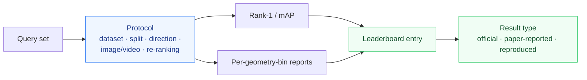

# 🧪 Evaluation Guide

How to report aerial-ground person ReID results so that they can be **compared, reproduced and trusted**.

## 🧭 From protocol to leaderboard

## 📐 Core metrics

| Metric | What it measures |
|---|---|
| **Rank-1 / CMC**[^1] | Whether the first retrieved gallery identity is correct |
| **mAP** | Average precision over queries — ranking quality beyond the first match |

[^1]: CMC (cumulative matching characteristics) reports the probability that the correct match appears within the top-*k* retrievals. Rank-1 is the top-*k* curve evaluated at *k = 1*.

## 🧭 Direction matters

Aerial-ground benchmarks may report distinct query/gallery directions:

| Direction | Meaning |
|---|---|
| **A2G** | aerial query → ground gallery |
| **G2A** | ground query → aerial gallery |
| **A2A** | aerial query → aerial gallery |
| **G2G** | ground query → ground gallery |
| **ALL** | mixed query/gallery setup defined by the dataset |

> [!WARNING]
> **Do not combine directions into one leaderboard** unless the dataset defines an official aggregate. A2G and G2A are different problems with different difficulty profiles.

## 🖼️ Image vs video

Image-based and tracklet/video-based evaluation are separate settings.

> [!IMPORTANT]
> A method using temporal aggregation must **not** be ranked directly against a single-image method unless the benchmark explicitly defines a shared protocol.

## ✅ Required metadata for a leaderboard entry

Every result row should record:

- [ ] dataset version
- [ ] split / protocol
- [ ] query-gallery direction
- [ ] method
- [ ] backbone
- [ ] input resolution, if known
- [ ] training data
- [ ] Rank-1 and mAP
- [ ] re-ranking yes/no
- [ ] result source
- [ ] result type: `official` / `paper-reported` / `reproduced`

## 🔁 Re-ranking

> [!WARNING]
> Results with k-reciprocal or other re-ranking must be **separated** from raw embedding retrieval results. Re-ranking changes the ranking distribution and is not comparable to plain cosine distance.

## 🕰️ Cross-session and clothing change

For datasets such as **DetReIDX**, same-session and cross-session retrieval answer **different scientific questions**. The leaderboard must preserve that distinction.

| Protocol | Question |
|---|---|
| Same-session | Short-term identity matching under fixed appearance |
| Cross-session / clothing change | Long-term identity retention under appearance change |

## 📏 Geometry-conditioned evaluation

> [!TIP]
> When altitude, distance or view angle are available, report performance **per geometry bin** in addition to aggregate performance. This distinguishes genuine robustness from performance dominated by easier camera configurations.

| Report | Purpose |
|---|---|
| Aggregate Rank-1 / mAP | Single-number summary |
| Per-bin Rank-1 / mAP (altitude, distance, view angle) | Robustness diagnosis |
| Error bars / confidence | Statistical reliability |

---

> [!TIP]
> Ready to submit a result? Use the [benchmark result issue template](https://github.com/kailashhambarde/Aerial-Ground-Person-ReID/issues/new/choose) and check the [leaderboard rules](../leaderboards/README.md).
