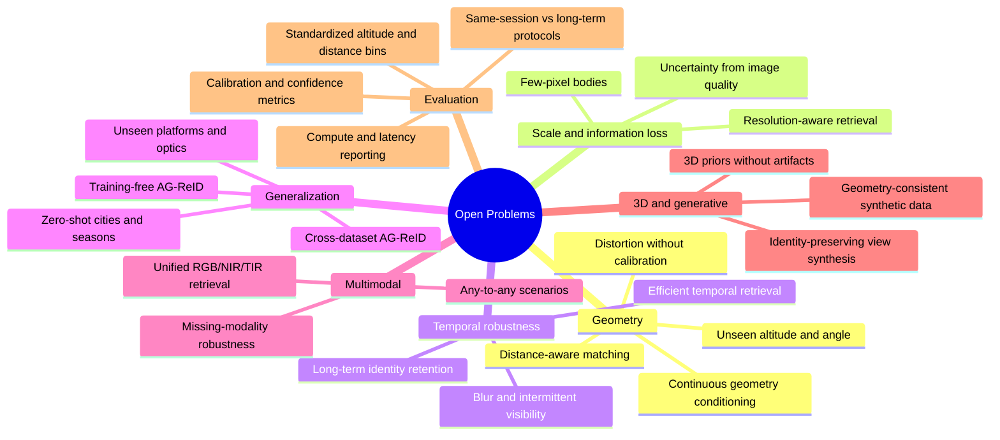

# 🔭 Open Research Problems

Research gaps worth attacking — not a claim that no prior paper has touched them.

## 📐 Geometry

- Unseen altitude and camera-angle generalization
- Continuous geometry conditioning rather than discrete view labels
- Camera-to-subject distance-aware matching
- Perspective distortion modeling without requiring calibration at deployment

## 🔍 Scale and information loss

- Recognition when the body occupies only a few pixels
- Uncertainty estimates tied to observable image quality
- Resolution-aware retrieval rather than resolution-agnostic embeddings

## ⏱️ Temporal robustness

- Tracklet aggregation under severe blur and intermittent visibility
- Long-term identity retention across sessions and clothing changes
- Efficient temporal retrieval for very long aerial sequences

## 🌍 Generalization

- Cross-dataset AG-ReID
- Training-free AG-ReID
- Domain generalization to unseen UAV platforms and camera optics
- Zero-shot transfer to unseen cities, seasons and weather

## 🌐 Multimodal

- Unified RGB / NIR / TIR / aerial / ground retrieval
- Missing-modality robustness
- Any-to-any scenario retrieval with one deployed model

## 🧊 3D and generative modeling

- Identity-preserving aerial view synthesis from ground references
- Geometry-consistent synthetic data generation
- Using 3D priors without introducing reconstruction artifacts that damage identity cues

## 📊 Evaluation

- Standardized altitude and distance bins
- Protocols that separate same-session from long-term ReID
- Calibration and confidence metrics, not only Rank-1 and mAP
- Compute and latency reporting for deployable UAV systems

---

> [!TIP]
> Working on one of these? The repository tracks methods by the problem they solve — add your paper via the [paper issue template](https://github.com/kailashhambarde/Aerial-Ground-Person-ReID/issues/new/choose) so it lands in the right taxonomy family.
