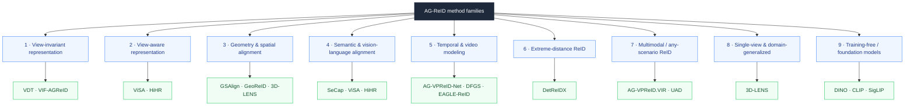

# 🧬 Method Taxonomy

The purpose of this taxonomy is to organize methods by the **problem they attempt to solve**, not by publication year alone.

> [!NOTE]
> Families are not mutually exclusive — **ViSA** appears under both view-aware and semantic alignment, **3D-LENS** under both geometry and single-view generalization. A method is listed wherever its *main* idea contributes.

## 🗺️ Family tree

---

## 1. View-invariant representation

**Goal:** learn identity features that change as little as possible between aerial and ground observations.

| Direction | Examples |
|---|---|
| Explicit view-invariant feature learning | **VIF-AGReID** |
| View-related / view-unrelated disentanglement | **VDT** |
| Rotation and pose augmentation | VIF-AGReID |
| Angular or metric constraints | — |

## 2. View-aware representation

**Goal:** preserve discriminative view-specific cues instead of forcing all views into a single invariant representation.

| Examples | Key question |
|---|---|
| **ViSA**, **HiHR** | *Which information should be aligned across views — and which should remain view-specific?* |

> [!TIP]
> This is the central design tension of AG-ReID: too much invariance discards discriminative cues, too little breaks cross-view matching.

## 3. Geometry and spatial alignment

**Goal:** compensate for perspective distortion, scale change and spatial misalignment caused by camera geometry.

| Subfamily | Examples |
|---|---|
| Feature-space geometric transformation | **GSAlign** |
| Similarity-space conditioning | **GeoReID** |
| Camera-geometry conditioning | **GeoReID** |
| 3D reconstruction / novel-view synthesis | **3D-LENS** |

## 4. Semantic and vision-language alignment

**Goal:** use semantic priors, prompts or pretrained vision-language models to obtain representations that are less sensitive to raw appearance changes.

| Direction | Examples |
|---|---|
| Adaptive prompt learning | **SeCap** |
| View-aware semantic alignment | **ViSA** |
| Vision-language hyperbolic learning | **HiHR** |

## 5. Temporal and video modeling

**Goal:** aggregate tracklets while suppressing blur, low-resolution frames, occlusion and view transitions.

| Direction | Examples |
|---|---|
| Temporal aggregation, scale-aware | **AG-VPReID-Net** |
| CLIP-guided sampling + uncertainty fusion | **DFGS + uncertainty fusion** |
| Strategic alignment + delta consistency | **EAGLE-ReID** |

## 6. Extreme-distance ReID

**Goal:** handle the regime where identity evidence collapses because the pedestrian occupies very few pixels.

**Relevant benchmark:** [**DetReIDX**](datasets.md)

| Important factors |
|---|
| Altitude |
| Camera-to-subject distance |
| Body pixel height |
| Motion blur |
| Compression |
| Tracklet quality |

## 7. Multimodal / any-scenario ReID

**Goal:** retrieve identities across both viewpoint *and* sensing-modality changes.

| Examples |
|---|
| **AG-VPReID.VIR** (RGB + infrared video) |
| **WHU-MARS / UAD** (RGB + NIR + TIR, any scenario) |

## 8. Single-view and domain-generalized AG-ReID

**Goal:** generalize to aerial views when paired aerial-ground training data are missing or limited.

| Example |
|---|
| **3D-LENS** — 3D lifting + novel-view synthesis from a single view |

## 9. Training-free / foundation-model evaluation

> [!WARNING]
> This remains **underdeveloped as a standardized AG-ReID protocol**. This repository tracks direct DINO/CLIP/SigLIP-style feature baselines separately from task-specific fine-tuning, so zero-shot capability is not conflated with supervised adaptation.

See the [Foundation-Model Baselines](foundation_models.md) plan for the reporting protocol.

---

> [!TIP]
> Think a family is missing or a method is filed wrong? Open a [paper issue](https://github.com/kailashhambarde/Aerial-Ground-Person-ReID/issues/new/choose) — taxonomy updates are welcome.
